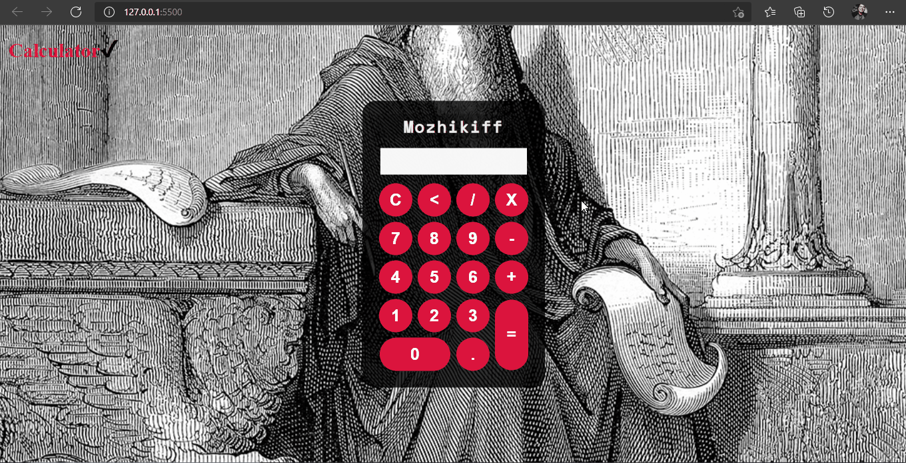

Isso é uma calculadora simples que realiza as principais operações básicas de matemática,
Comparado a outras de IMC <a href="https://github.com/Oleg-martsenie/IMC-Calculator">IMC - Calculator</a> essa foi bastante simples, mas ainda assim encontrei certas dificuldades, uma em específico que me tirou bastante tempo, falahas são bons, pois nos ajudam a melhorar.

<h1>Especificações</h1>

É um proejeto realizado em HTML5, CSS3 e JS. Uma calcualdora com código simples. Todavia acredito que poderia ter deminuído ele. Assim que aprender mais sobre eventos de cliques quero melhora-lá

<h2>Gif do Resultado Final</h2>

